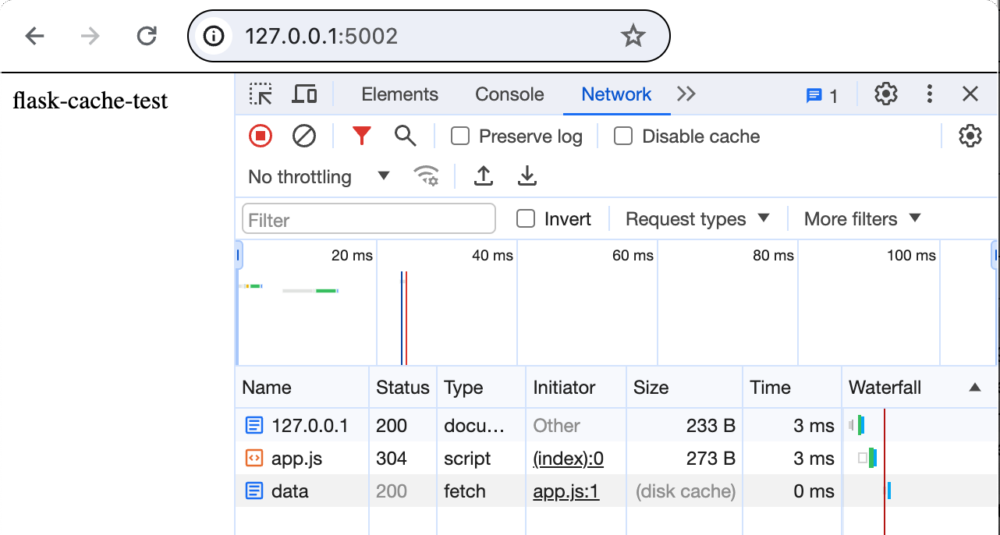

# flask-cache-test

Test the functionality of the `Cache-Control: max-age` header



## Requirements

- [pyenv](https://github.com/pyenv/pyenv)

## Setup

```bash
$ ./scripts/setup
```

## Development

NOTE: You must use `127.0.0.1` rather than `localhost`.

### Ports

| Service           | Port                            |
| ----------------- | ------------------------------- |
| Flask app         | [`5002`](http://127.0.0.1:5002) |

## Scripts

| Name     | Description                        |
|----------|------------------------------------|
| `server` | Run the application                |
| `update` | Install dependencies               |
| `setup`  | Set up the development environment |
